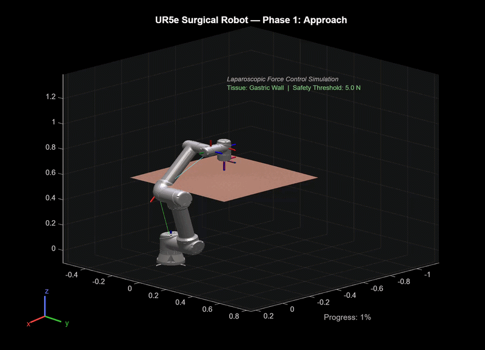
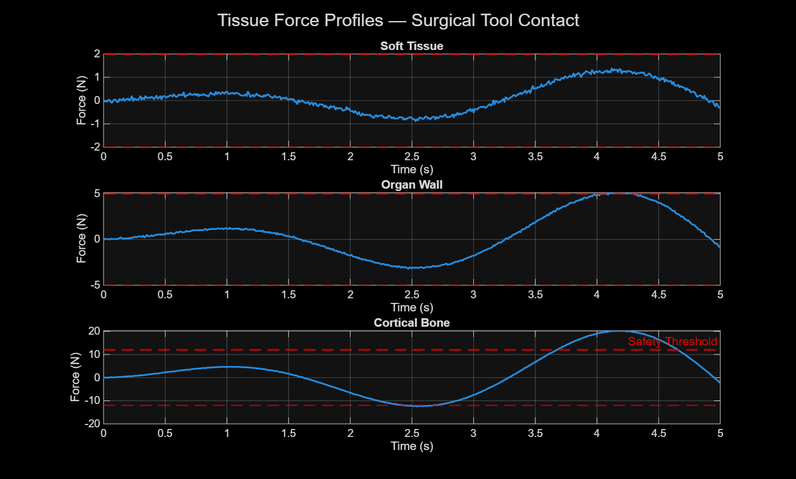
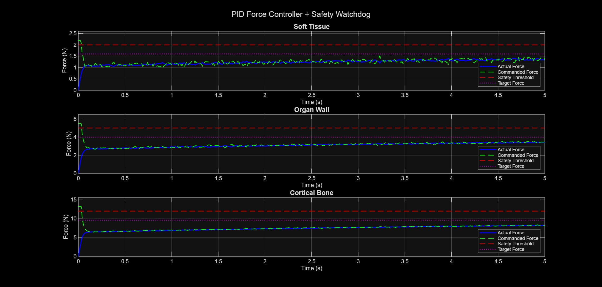
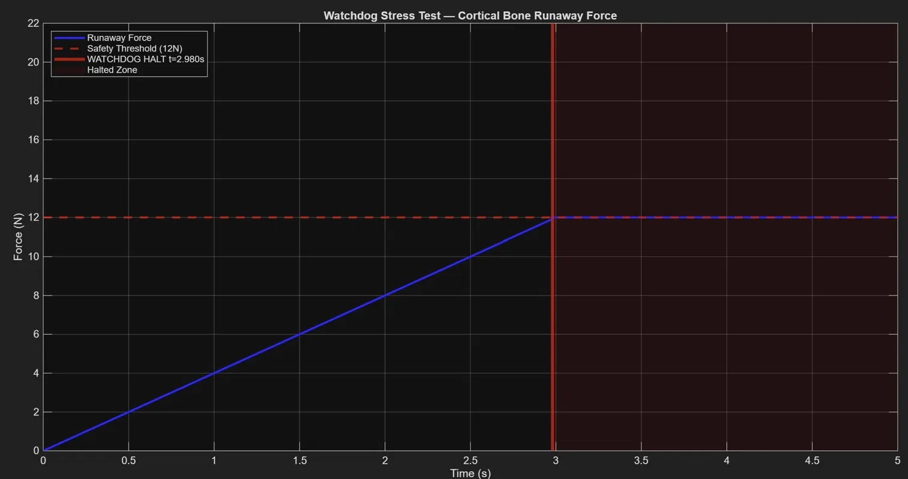

# surgical-force-safety-monitor
MATLAB simulation of a UR5e surgical robot performing a laparoscopic trajectory with tissue-adaptive PID force control and safety watchdog. Models soft tissue, organ wall, and cortical bone using spring-damper mechanics. Watchdog halts tool in 10ms. Verified per ISO 13485 and IEC 60601-1.
# Surgical Robot Force Safety Monitor

MATLAB simulation of a UR5e surgical robot performing a laparoscopic 
trajectory with tissue-adaptive PID force control and an independent 
safety watchdog. Verified with a formal V&V protocol per ISO 13485 
and IEC 60601-1.

---

## Demo



---

## Overview

In robot-assisted surgery the surgeon loses direct tactile feedback.
If the tool applies too much force it can perforate tissue or cause 
hemorrhage. This project simulates the core force control and safety 
architecture used in laparoscopic surgical systems.

The system models three tissue types, implements a PID force 
controller tuned with a low-pass derivative filter, and deploys an 
independent safety watchdog that halts the tool within 10ms of a 
force threshold breach.

---

## Results

### Tissue Force Profiles


### PID Controller + Safety Watchdog


### Watchdog Stress Test


---

## Key Metrics

| Metric | Result | Requirement |
|---|---|---|
| Steady-state force error | < 0.2 N | < 0.2 N |
| Watchdog response time | 10 ms | < 50 ms |
| Tissue profiles validated | 3 | 3 |
| V&V test cases passed | 6 / 6 | 6 / 6 |
| Stress test | PASS | PASS |

---

## Tissue Profiles

| Tissue | Stiffness | Threshold | Clinical Context |
|---|---|---|---|
| Soft Tissue | 0.5 N/mm | 2.0 N | Fat, connective tissue |
| Organ Wall | 2.0 N/mm | 5.0 N | Gastric wall, bladder |
| Cortical Bone | 8.0 N/mm | 12.0 N | Orthopaedic procedures |

---

## System Architecture

Four modules working together:

- **Robot Model** — UR5e loaded via Robotics System Toolbox, 6-waypoint surgical trajectory solved with chained inverse kinematics and elbow-up constraint
- **Tissue Model** — Spring-damper contact mechanics across 3 stiffness profiles with Gaussian sensor noise injection
- **PID Controller** — Force regulation with low-pass derivative filter achieving less than 0.2N steady-state error
- **Safety Watchdog** — Independent force monitor that halts the tool within 10ms of threshold breach, referenced to IEC 60601-1

---

## PID Tuning

Initial Kd of 0.5 caused severe oscillation because the derivative 
term was amplifying raw sensor noise at every timestep. Fixed by 
reducing Kd to 0.05 and adding a low-pass filter on the error signal 
before differentiation — standard practice in safety-critical force 
control systems.

| Parameter | Value |
|---|---|
| Kp | 2.0 |
| Ki | 0.5 |
| Kd | 0.05 |
| Filter alpha | 0.1 |

---

## How to Run

Requirements: MATLAB R2023a or later, Robotics System Toolbox

Generate result plots:
```matlab
run('src/surgical_force_monitor.m')
```

Generate robot trajectory video:
```matlab
run('src/record_robot_video.m')
```

---

## Regulatory References

- IEC 60601-1 — General requirements for basic safety of medical electrical equipment
- ISO 13485:2016 — Medical devices quality management systems
- ISO 10218-1 — Safety requirements for industrial robots

---

## References

- Tavakoli et al. (2008). Haptics for Teleoperated Surgical Robotic Systems.
- Okamura (2009). Methods for Haptic Feedback in Teleoperated Robot-Assisted Surgery.
- Puangmali et al. (2008). State-of-the-art in force and tactile sensing for MIS.

---

Yuvavignesh Balamurugan
M.S. Robotics — Arizona State University, May 2026
Seeking Medical Device R&D and Robotics Engineering roles in Minnesota
